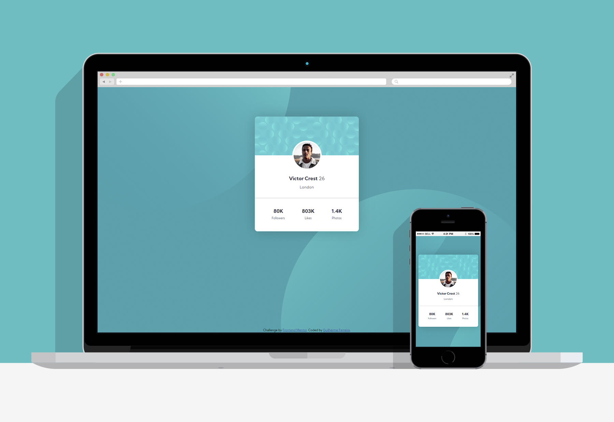

# | Profile card component solution
## This is a solution to the [Profile card component challenge on Frontend Mentor](https://www.frontendmentor.io/challenges/profile-card-component-cfArpWshJ).
### Project/Challange proposal: Build out the project to the designs provided.

  

# | Screenshots

 

# | Live View
- [Live Site Link](https://guilhermerera.github.io/profile-card-component-main%20(html5%20css3)/)
- [FrontEnd Mentor Solution](https://www.frontendmentor.io/solutions/html5-and-css3-profile-card-component-with-double-background-e35tlRlBF)

 

# | What I learned
This was a really fun project. I didn't know you could use two photos to create a cool composition as a background and this little project taught me this big lesson! :)

 

# | Built With
    

 

# | Find Me
  